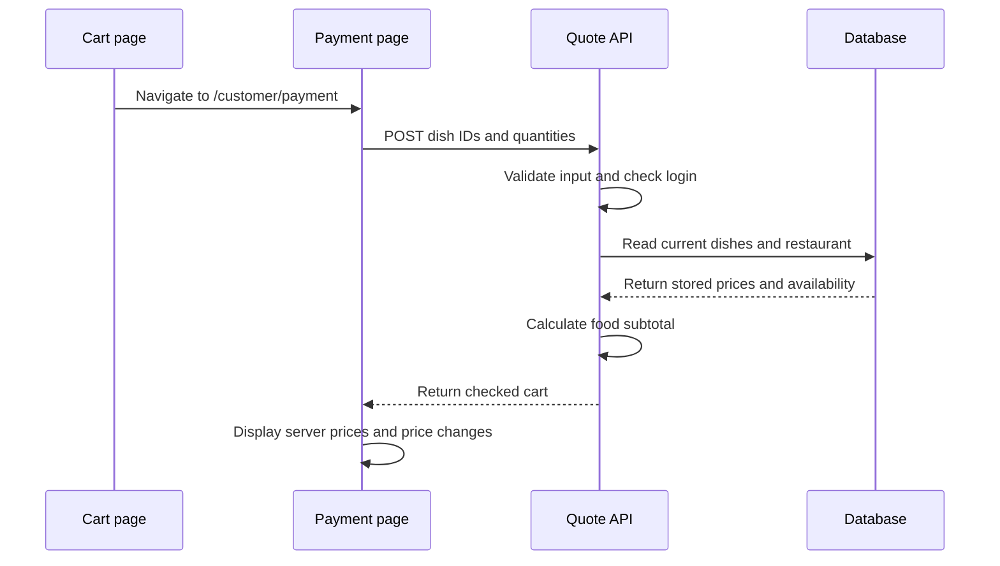

# Build checkout and Razorpay payments in FoodIO

This guide starts with a working price review page. Add the code in steps 1 to 6. Those steps do not charge money. Steps 8 to 12 describe the payment stage that follows.

Your app uses Next.js App Router, TypeScript, Drizzle and Neon PostgreSQL. Its root layout already contains `CartProvider`, so the cart can stay available when you move between customer pages.

## 1. Understand what the server must do

Your proposed flow is close. Change one rule: a matching browser price does not make the browser trusted. Always use database prices to calculate the charge. Compare prices only to tell the customer that a price changed.

The browser sends the customer's choices. The server checks whether those choices are allowed.

| Value | Source used by the server |
| --- | --- |
| Dish ID and requested quantity | Browser request, after validation |
| Current dish name and price | `menu_items` table |
| Dish availability | `menu_items.isAvailable` and `isActive` |
| Restaurant and its status | Database records |
| Customer identity | Verified login cookie through `currentProfile()` |
| Delivery fee and other charges | Server rules, which we must define before payment |
| Food subtotal | Server calculation using database prices |

For this first stage, show the food subtotal. Do not call it the final payment total because delivery fees and the delivery address are not implemented here. Opening hours and the delivery area also need checks before placing a real order.



A quote is a checked price summary at one point in time. This first quote is not saved and does not reserve a price. The server must check the cart again when the customer starts payment.

## 2. Tell pages when the cart has finished loading

Edit `components/cart/cart-provider.tsx`.

Your provider first starts with an empty array. It then loads the saved cart from `localStorage`. Other pages need to know when that process is complete.

Add this property inside the existing `cartContextValue` interface. Keep its other properties.

```ts
// False while the provider is reading the saved browser cart.
// True once that attempt is complete, even if there was no saved cart.
isReady: boolean
```

In the provider's existing `value` object, add one property. The complete object becomes:

```tsx
value={{
  items,
  addItem,
  replaceCart,
  updateQuantity,
  removeItem,
  // This state already exists in your provider.
  // Exposing it lets the payment page wait before requesting a quote.
  isReady: loadedFromStorage,
}}
```

Connection: `CartProvider` loads storage, then `useCart()` gives the payment page both the saved items and `isReady`.

## 3. Define the request and response shapes

Create `lib/checkout/schema.ts`.

This module can be imported by browser and server code. It contains no database connection and no secret.

```ts
import { z } from "zod"

// The browser sends only the choices needed to look up dishes.
// It does not send a price or a customer ID.
export const checkoutRequestSchema = z
  .object({
    items: z
      .array(
        z
          .object({
            // Your database uses a positive integer menu item ID.
            id: z.number().int().positive(),
            // These are initial FoodIO limits. We can change them later.
            // Fractions, zero, negative numbers and huge quantities fail.
            quantity: z.number().int().min(1).max(20),
          })
          .strict()
      )
      .min(1)
      .max(50),
  })
  .strict()
  .refine(
    // Your cart stores one row for each dish.
    // Reject repeated IDs instead of counting the same dish twice.
    (request) =>
      new Set(request.items.map((item) => item.id)).size ===
      request.items.length,
    { message: "Each dish must appear only once." }
  )

// This describes the checked data returned by the server.
// The browser also uses it to check the response before displaying it.
export const checkoutQuoteSchema = z.object({
  restaurantId: z.string().uuid(),
  restaurantName: z.string(),
  currency: z.literal("INR"),
  items: z.array(
    z.object({
      id: z.number().int().positive(),
      name: z.string(),
      quantity: z.number().int().min(1).max(20),
      unitPriceInPaise: z.number().int().nonnegative(),
      lineTotalInPaise: z.number().int().nonnegative(),
    })
  ),
  subtotalInPaise: z.number().int().nonnegative(),
})

// Infer creates TypeScript types from these validation schemas.
// This avoids maintaining separate type and validation definitions.
export type CheckoutRequest = z.infer<typeof checkoutRequestSchema>
export type CheckoutQuote = z.infer<typeof checkoutQuoteSchema>
```

Connection: the API checks incoming JSON with `checkoutRequestSchema`. The page checks returned JSON with `checkoutQuoteSchema`.

`.strict()` rejects extra request fields. If someone adds a fake price field to this request, the API will reject it.

## 4. Read database prices and calculate the quote

Create `lib/checkout/get-checkout-quote.ts`.

Keep this calculation separate from the route. Later, both the quote route and the payment order route can call it.

```ts
// This function reads the database. It must stay on the server.
import "server-only"

import { eq, inArray } from "drizzle-orm"
import { db } from "@/lib/db/drizzle"
import { menuItems, restaurants } from "@/lib/db/schema/schema"
import type { CheckoutQuote, CheckoutRequest } from "./schema"

// A known cart problem can be shown to the customer.
// Unexpected database failures will receive a generic error instead.
export class CheckoutError extends Error {}

export async function getCheckoutQuote(
  request: CheckoutRequest
): Promise<CheckoutQuote> {
  const ids = request.items.map((item) => item.id)

  // Read every requested dish in one query.
  // The join also reads the restaurant that owns each dish.
  // Nothing here uses the restaurant name or price from browser storage.
  const rows = await db
    .select({
      id: menuItems.id,
      name: menuItems.name,
      priceInPaise: menuItems.priceInPaise,
      isAvailable: menuItems.isAvailable,
      isActive: menuItems.isActive,
      restaurantId: restaurants.id,
      restaurantName: restaurants.name,
      restaurantStatus: restaurants.status,
    })
    .from(menuItems)
    .innerJoin(restaurants, eq(menuItems.restaurantId, restaurants.id))
    .where(inArray(menuItems.id, ids))

  // A missing row means a dish no longer exists or has no restaurant.
  // Reject the whole cart rather than silently dropping a dish.
  if (rows.length !== ids.length) {
    throw new CheckoutError("A dish no longer exists. Review your cart.")
  }

  const firstRow = rows[0]
  if (!firstRow) {
    throw new CheckoutError("Your cart is empty.")
  }

  // FoodIO currently allows dishes from only one restaurant per cart.
  // Recheck that rule here because browser rules can be bypassed.
  if (rows.some((row) => row.restaurantId !== firstRow.restaurantId)) {
    throw new CheckoutError("Choose dishes from one restaurant.")
  }

  if (rows.some((row) => row.restaurantStatus !== "ACTIVE")) {
    throw new CheckoutError("This restaurant cannot accept orders.")
  }

  if (rows.some((row) => !row.isActive || !row.isAvailable)) {
    throw new CheckoutError("A dish is unavailable. Review your cart.")
  }

  // Guard against invalid stored prices as well as invalid requests.
  // A database value is authoritative, but it still needs to be usable.
  if (
    rows.some(
      (row) =>
        !Number.isSafeInteger(row.priceInPaise) || row.priceInPaise < 0
    )
  ) {
    throw new Error("A stored dish price is invalid.")
  }

  // SQL does not promise the same row order as the requested ID list.
  // A Map lets us find the correct database row for each requested dish.
  const rowsById = new Map(rows.map((row) => [row.id, row]))

  const items = request.items.map((requestedItem) => {
    const row = rowsById.get(requestedItem.id)
    if (!row) {
      throw new CheckoutError("A dish no longer exists.")
    }

    return {
      id: row.id,
      name: row.name,
      // Quantity is the customer's requested quantity, validated above.
      quantity: requestedItem.quantity,
      // The unit price comes only from the database.
      unitPriceInPaise: row.priceInPaise,
      lineTotalInPaise: row.priceInPaise * requestedItem.quantity,
    }
  })

  // Add all line totals using integer paise.
  // Example: 15000 paise per dish × 2 dishes = 30000 paise.
  const subtotalInPaise = items.reduce(
    (sum, item) => sum + item.lineTotalInPaise,
    0
  )

  if (!Number.isSafeInteger(subtotalInPaise)) {
    throw new Error("The calculated subtotal is invalid.")
  }

  return {
    restaurantId: firstRow.restaurantId,
    restaurantName: firstRow.restaurantName,
    currency: "INR",
    items,
    subtotalInPaise,
  }
}
```

Connection: the route passes validated dish IDs and quantities to this function. The function reads current records and returns a checked quote.

This function assumes its argument has passed `checkoutRequestSchema`. Every route that calls it must validate first.

## 5. Make a server route that the browser can call

Create `app/api/checkout/quote/route.ts`.

Next.js maps this file to `POST /api/checkout/quote`. You do not need a separate Express server.

```ts
import { currentProfile } from "@/lib/auth/current-profile"
import {
  CheckoutError,
  getCheckoutQuote,
} from "@/lib/checkout/get-checkout-quote"
import { checkoutRequestSchema } from "@/lib/checkout/schema"

export async function POST(request: Request) {
  try {
    // Identify the customer from the verified cookie.
    // A customer ID supplied in JSON would be unsafe to trust.
    const profile = await currentProfile()
    if (!profile) {
      return Response.json(
        { error: "Sign in before checkout." },
        { status: 401 }
      )
    }

    // Only customer accounts can use this checkout route.
    if (!profile.roles.includes("CUSTOMER")) {
      return Response.json(
        { error: "A customer account is required." },
        { status: 403 }
      )
    }

    // JSON parsing checks that the body is valid JSON.
    // It does not check the fields. Zod does that below.
    let body: unknown
    try {
      body = await request.json()
    } catch {
      return Response.json(
        { error: "Send a valid JSON request." },
        { status: 400 }
      )
    }

    const parsed = checkoutRequestSchema.safeParse(body)
    if (!parsed.success) {
      return Response.json(
        { error: "Send 1 to 50 distinct dishes, with 1 to 20 of each." },
        { status: 400 }
      )
    }

    const quote = await getCheckoutQuote(parsed.data)

    // This is a current price check. Do not store its response in a cache.
    return Response.json(quote, {
      headers: { "Cache-Control": "no-store" },
    })
  } catch (error) {
    if (error instanceof CheckoutError) {
      // 409 means the requested cart conflicts with current stored data.
      return Response.json({ error: error.message }, { status: 409 })
    }

    // Keep database and internal error details in the server log.
    console.error("Could not calculate checkout quote.", error)
    return Response.json(
      { error: "Could not check your cart. Try again." },
      { status: 500 }
    )
  }
}
```

Connection: `fetch()` on the payment page calls this route. The route checks login and input, then calls `getCheckoutQuote()`.

This route only reads data. It does not save an order, send an email, or start a payment.

## 6. Add the payment review page and enable navigation

Create `app/(pages)/(public)/customer/payment/page.tsx`.

The route groups in parentheses do not appear in the URL. This page opens at `/customer/payment`.

```tsx
"use client"

import Link from "next/link"
import { useEffect, useMemo, useState } from "react"
import { useCart } from "@/components/cart/cart-provider"
import { Button } from "@/components/ui/button"
import {
  type CheckoutQuote,
  checkoutQuoteSchema,
} from "@/lib/checkout/schema"

const money = new Intl.NumberFormat("en-IN", {
  style: "currency",
  currency: "INR",
})

function formatMoney(paise: number) {
  // Keep calculations in paise. Convert to rupees only for display.
  return money.format(paise / 100)
}

type QuoteState = {
  // Records the exact request that produced this result.
  // This prevents an old quote from being displayed for a changed cart.
  requestBody: string
  quote: CheckoutQuote | null
  error: string | null
}

export default function PaymentPage() {
  const { items, isReady } = useCart()
  const [state, setState] = useState<QuoteState | null>(null)
  const [attempt, setAttempt] = useState(0)

  const requestBody = useMemo(
    () =>
      JSON.stringify({
        // Do not send the browser price, dish name or customer ID.
        // The server gets those values from its own sources.
        items: items.map((item) => ({
          id: item.id,
          quantity: item.quantity,
        })),
      }),
    [items]
  )

  useEffect(() => {
    // Wait until localStorage has been checked.
    // An empty cart does not need a database request.
    if (!isReady || items.length === 0) {
      return
    }

    // Stop this request when the page leaves or the cart changes.
    const controller = new AbortController()

    async function loadQuote() {
      try {
        const response = await fetch("/api/checkout/quote", {
          method: "POST",
          headers: { "Content-Type": "application/json" },
          body: requestBody,
          // Same-origin includes the existing FoodIO login cookie.
          credentials: "same-origin",
          cache: "no-store",
          signal: controller.signal,
        })

        const body: unknown = await response.json()

        if (!response.ok) {
          // Read a customer-facing message only if it is a string.
          const message =
            typeof body === "object" &&
            body !== null &&
            "error" in body &&
            typeof body.error === "string"
              ? body.error
              : "Could not check your cart."
          throw new Error(message)
        }

        // Check the response shape before using its fields.
        const parsed = checkoutQuoteSchema.safeParse(body)
        if (!parsed.success) {
          throw new Error("The server returned an invalid cart summary.")
        }

        if (!controller.signal.aborted) {
          setState({ requestBody, quote: parsed.data, error: null })
        }
      } catch (error) {
        // Cancellation is expected when a page leaves or a cart changes.
        // Do not show it as a payment error.
        if (controller.signal.aborted) {
          return
        }

        setState({
          requestBody,
          quote: null,
          error:
            error instanceof Error
              ? error.message
              : "Could not check your cart.",
        })
      }
    }

    void loadQuote()
    return () => controller.abort()
  }, [isReady, items.length, requestBody, attempt])

  if (!isReady) {
    return <p role="status">Loading your cart...</p>
  }

  if (items.length === 0) {
    return (
      <div className="space-y-4">
        <p>Your cart is empty.</p>
        <Link href="/customer">Choose food</Link>
      </div>
    )
  }

  // Ignore a result from a previous cart immediately.
  // We do not need to wait for the next effect to hide stale data.
  const currentState = state?.requestBody === requestBody ? state : null

  if (currentState?.error) {
    return (
      <div className="space-y-4">
        <p role="alert">{currentState.error}</p>
        <Link href="/customer/order">Review cart</Link>
        <Link href="/login/customer">Sign in</Link>
        <Button
          onClick={() => {
            // Clear the old error and run the effect again.
            setState(null)
            setAttempt((value) => value + 1)
          }}
        >
          Try again
        </Button>
      </div>
    )
  }

  const quote = currentState?.quote
  if (!quote) {
    return <p role="status">Checking current prices...</p>
  }

  // This comparison is only a message for the customer.
  // It never changes the subtotal calculated by the server.
  const priceChanged = quote.items.some((checkedItem) => {
    const cartItem = items.find((item) => item.id === checkedItem.id)
    return cartItem?.priceInPaise !== checkedItem.unitPriceInPaise
  })

  return (
    <section className="mx-auto w-full max-w-xl space-y-6">
      <h1 className="text-2xl font-semibold">Review payment</h1>
      <p>{quote.restaurantName}</p>

      {priceChanged ? (
        <p role="status">
          A price changed. Review the current prices below.
        </p>
      ) : null}

      <ul className="space-y-4">
        {quote.items.map((item) => (
          <li key={item.id} className="flex justify-between gap-4">
            <div>
              {/* Names and prices below come from the checked quote. */}
              <p>{item.name}</p>
              <p>
                {item.quantity} × {formatMoney(item.unitPriceInPaise)}
              </p>
            </div>
            <p>{formatMoney(item.lineTotalInPaise)}</p>
          </li>
        ))}
      </ul>

      <p className="font-semibold">
        Food subtotal: {formatMoney(quote.subtotalInPaise)}
      </p>
      <p className="text-sm text-muted-foreground">
        Delivery fees and the delivery address will be added before payment.
      </p>

      {/* Enable payment only after saved orders and verification exist. */}
      <Button disabled>Payment setup pending</Button>
      <Link className="block" href="/customer/order">
        Back to cart
      </Link>
    </section>
  )
}
```

Now edit `components/cart/components/cart.tsx`.

Add this import:

```ts
// App Router navigation lets the button open the payment page.
import { useRouter } from "next/navigation"
```

Inside `ModernCart()`, add the router and update the existing cart read:

```ts
const router = useRouter()

// isReady prevents navigation before the saved cart has loaded.
const { items, isReady, updateQuantity, removeItem } = useCart()
```

Replace the existing disabled checkout button with:

```tsx
<Button
  className="w-full"
  // An empty or still-loading cart cannot proceed.
  disabled={!isReady || items.length === 0}
  onClick={() => {
    // Navigation does not charge money.
    // The next page reads the shared cart and requests a server quote.
    router.push("/customer/payment")
  }}
>
  <CreditCard className="mr-2 h-4 w-4" />
  Proceed to Checkout
</Button>
```

Connection: the button opens the page, the page reads `useCart()`, and its effect calls the quote API. The API reads database values and the page displays those returned values.

## 7. Check the first working stage

Run:

```bash
# Check TypeScript types and imports.
pnpm typec

# Start FoodIO if it is not already running.
pnpm dev
```

Sign in with a customer account. Add a dish, then open the cart at `/customer/order` and click Proceed to Checkout.

| Check | Expected result |
| --- | --- |
| Open checkout with a saved cart | Current dish names, prices and subtotal appear |
| Reload `/customer/payment` | Page waits for storage, then checks prices again |
| Empty cart | Checkout button is disabled |
| Change a stored browser price | Server subtotal stays correct; page reports a price change |
| Send quantity `0`, `1.5` or `21` in the request | API returns 400 |
| Send a fake dish ID | API returns 409 |
| Send dishes from two restaurants | API returns 409 |
| Request an unavailable dish | API returns 409 |
| Sign out, then request a quote | API returns 401 |
| Stop the network request | Page shows an error and offers retry |

Use disposable test menu data when changing database prices or availability. Use the browser Network panel to inspect the request and response. The quote request should contain only IDs and quantities.

The code was type-checked in an isolated copy of the project. These browser and database checks still need to be run after you add the code. The guide itself does not change your app files.

## 8. Add delivery details and saved food orders

The next stage needs a delivery address, delivery rules and a final server-calculated total. Ask the customer to review that total before starting payment.

Add these tables to `lib/db/schema/schema.ts` before building the payment endpoint:

| Table | Data it needs |
| --- | --- |
| `orders` | ID, customer ID, restaurant ID, address snapshot, food subtotal, fees, total, currency, food status, timestamps |
| `order_items` | FoodIO order ID, dish reference, purchased dish name, unit price, quantity and line total |
| `payment_attempts` | FoodIO order ID, Razorpay order ID, Razorpay payment ID, payment status, expected amount and currency |
| `payment_events` | Unique webhook event ID and processing record, for duplicate handling |

Keep the purchased names and prices as snapshots. A later menu edit must not rewrite an old order. Keep food status separate from payment status.

Use a checkout request key scoped to the customer, enforced by a unique database constraint. This key identifies a repeated checkout request. Retrying the same request must return the same food order instead of creating another one. Disable the Pay button during the request as a user interface measure, but enforce duplicates on the server too.

Save the order and its items in one database transaction. Do not keep that transaction open while calling Razorpay over the network. An external API call cannot be rolled back by PostgreSQL.

Define how to recover if the Razorpay request times out after it creates an order. A receipt field helps identify the order, but it is not a substitute for request deduplication and reconciliation.

## 9. Create the Razorpay order on the server

Create a future route at `app/api/payments/orders/route.ts`. The page calls it only when the customer confirms the final total.

The route must:

1. Check the login, customer role and same-origin request policy for this mutation.
2. Validate IDs, quantities, delivery details and the checkout request key.
3. Call the shared cart checker again. A page quote can be out of date.
4. Calculate delivery fees and any other supported charges on the server.
5. If the displayed total changed, return the new review data and ask for confirmation again.
6. Save or reuse the pending FoodIO order and its item snapshots.
7. Create a Razorpay order using the saved amount.
8. Save the Razorpay order ID against the payment attempt before returning checkout details.

This fragment shows the SDK call. It is not a complete route. `savedOrder` must come from the authenticated server flow above, and `getRazorpay()` is the server client from the previous lesson.

```ts
// This amount comes from the saved server calculation.
// Never copy an amount directly from the browser request.
const razorpayOrder = await getRazorpay().orders.create({
  amount: savedOrder.totalInPaise,
  currency: "INR",
  // A UUID fits Razorpay's 40-character receipt limit.
  receipt: savedOrder.id,
})

// Before replying to the browser, persist razorpayOrder.id against
// this payment attempt. Verification and webhooks need that link.
```

Razorpay creates an order before Checkout starts. The order ID ties later payment attempts to the requested amount. Creating it does not charge the customer.

Source: [Razorpay order API](https://razorpay.com/docs/api/orders/create/).

## 10. Open Razorpay Checkout in the browser

Use Test Mode first. Configure automatic capture for this first integration.

Load `https://checkout.razorpay.com/v1/checkout.js` with Next.js `Script`. Track script loading and failure. Wait until the script is ready before enabling Pay.

The server returns the public Key ID, FoodIO order ID, Razorpay order ID, amount and currency. Keep the Key Secret on the server.

This fragment shows how those returned values connect to Checkout. It is not a complete React component. It still needs browser TypeScript declarations, loading state, failure handlers and `verifyPayment()`.

```ts
// checkoutData comes from the authenticated payment-order API.
// It contains no Key Secret.
const checkout = new window.Razorpay({
  key: checkoutData.keyId,
  order_id: checkoutData.razorpayOrderId,
  amount: checkoutData.amountInPaise,
  currency: checkoutData.currency,
  name: "FoodIO",
  description: "Food order payment",
  handler: async (result) => {
    // This callback starts SERVER verification.
    // Do not mark the order paid from this callback alone.
    await verifyPayment({
      foodioOrderId: checkoutData.foodioOrderId,
      ...result,
    })
  },
})

// Opens Razorpay's payment window for this payment order.
checkout.open()
```

The Razorpay order ID is a reference to the payment order. The customer enters payment details in Razorpay Checkout. Your FoodIO page does not collect card details.

Source: [Razorpay Checkout integration](https://razorpay.com/docs/payments/payment-gateway/web-integration/standard/integration-steps/).

## 11. Verify the result on the server

Create a future route at `app/api/payments/verify/route.ts`.

The route checks the logged-in customer owns the FoodIO order. It loads the saved payment attempt, then verifies the returned signature.

The expected signature is HMAC-SHA256 of the saved Razorpay order ID, a `|` separator and the returned payment ID, using your Key Secret. Use the stored order ID for this calculation. Do not use a browser-supplied order ID as the source of truth.

Fetch the payment from Razorpay. Confirm its order ID, amount and currency match the saved attempt. Only mark the order paid when the payment is captured. A valid signature alone does not establish captured payment.

Update the payment and food order in a transaction. Both callback verification and webhooks can arrive, so repeated confirmation must have no extra effect. A database condition or lock must prevent two handlers from confirming the same order twice.

Show a pending state if confirmation is still in progress. Clear the cart only after the server confirms payment for the correct order.

Sources: [Signature verification](https://razorpay.com/docs/payments/payment-gateway/web-integration/standard/integration-steps/), [capture settings](https://razorpay.com/docs/payments/payments/capture-settings/).

## 12. Add webhooks and finish payment tests

A webhook is an HTTP request that Razorpay sends to your server. It can confirm a captured payment even if the customer closes the tab before the browser callback runs.

Create a future route at `app/api/payments/webhook/route.ts`. Configure its public HTTPS URL in the Razorpay Dashboard. A localhost URL is not reachable from Razorpay; use a reachable test deployment or development tunnel.

Verify `X-Razorpay-Signature` using the exact raw body from `await request.text()` and a separate webhook secret. Parse JSON only after signature verification. Recreating JSON text can change the signed bytes.

Handle captured-payment events against the saved order and amount. Deduplicate events using `x-razorpay-event-id`. Do not assume events arrive once or in order. A late failure event must not overwrite a captured payment. Return success only after you have durably accepted or processed the event.

Also reconcile pending attempts if notifications are missed. Webhooks improve recovery, but delivery failures still need a recovery path.

Sources: [Webhook validation](https://razorpay.com/docs/webhooks/validate-test/), [webhook best practices](https://razorpay.com/docs/webhooks/best-practices/).

Before enabling real payments, test a successful payment, a failed attempt, closing Checkout, double-clicking Pay, a network timeout, a price change before payment, another customer's order ID, a fake signature, duplicate webhooks and a browser tab closing after payment.

The build sequence is: checked cart review, delivery details, saved food order, Razorpay order, Checkout, server verification, webhook recovery. Finish the first price review stage before adding the payment stage.
